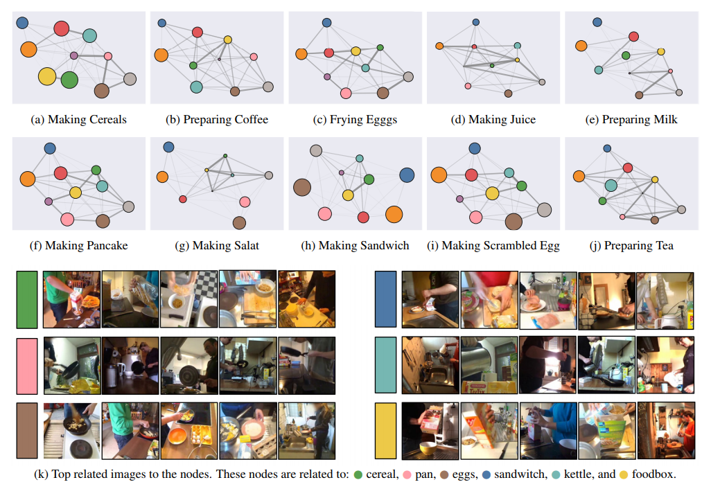
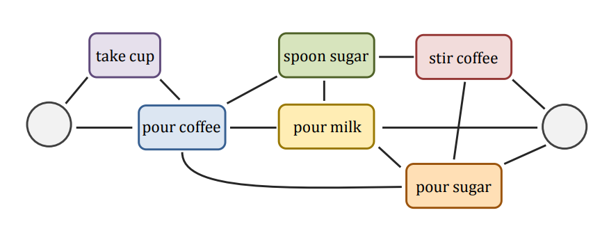
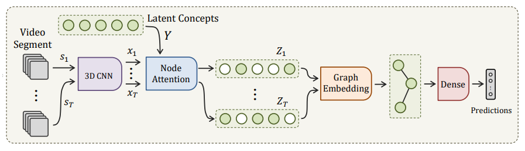
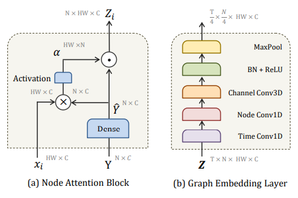
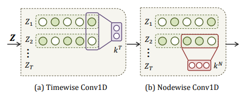

## VideoGraph: Recognizing Minutes-Long Human Activities in Videos

 

This code repository is the implementation for the paper [VideoGraph: Recognizing Minutes-Long Human Activities in Videos](https://arxiv.org/abs/1905.05143).
We provide the implementation for two different libraries: `keras`, `tensorflow`.

### Citation

Please consider citing this work using this BibTeX entry

```bibtex
@inproceedings{hussein2019videograph,
  title     = {VideoGraph: Recognizing Minutes-Long Human Activities in Videos},
  author    = {Hussein, Noureldien and Gavves, Efstratios and Smeulders, Arnold WM},
  booktitle = {ICCV Workshop on Scene Graph Representation and Learning},
  year      = {2019}
}
```

### Results



We visualize the relationship discovered by the first layer of graph embedding. Each sub-figure is related to one of the 10 activities in Breafast dataset. In each graph, the nodes represent the latent concepts learned by graph-attention block. Node size reflects how how dominant the concept, while graph edges emphasize the relationship between the nodes.

### Method

###### Motivation



The activity of “preparing coffee” can be represented as undirected graph of unit-actions. The graph is capable of portraying the many ways one can carry out such activity. More over, it preserves the temporal structure of the unit-actions. Reproduced from.

###### Model OverView



Overview diagram of the proposed VideoGraph. It takes as input a video segment s_i of 8 frames from an activity video v. Then, it represents it using standard 3D CNN, e.g. I3D. The corresponding feature representation is x_i . Then, a node attention block attends to a a set of N latent concepts based on their similarities with x_i , which results in the node-attenative representation Z_i . A novel graph embedding layer then processes Z_i to learn the relationships between its latent concepts, and arrives at the final video-level representation. Finally, an MLP is used for classification.

###### Node Attention and Graph Embedding



(a) Node attention block measures similarities \alpha between segment feature x_i and learned nodes \hat{Y} . Then, it attends to each node in \hat{Y} using \alpha . The result is the node-attentive feature Z_i expressing how similar each node to x_i . (b) Graph Embedding layer models a set of T successive node-attentive features Z using 3 types of convolutions. i. Timewise Conv1D learns the temporal transition between node-attentive features \{Z_i, ..., Z_{i+t}\} . ii. Nodewise Conv1D learns the relationships between nodes \{z_{i,j}, ..., z_{i,j+n}\} . iii. Channelwise Conv3D updates the representation for each node z_{ij} .

###### Graph Embedding



(a) Timewise Conv1D learns the temporal transition between successive nodes-embeddings \{Z_i, ..., Z_{i+t}\} using kernel k^T of kernel size t . (b) Nodewise Conv1D learns the relationships between consecutive nodes \{z_{i,j}, ..., z_{i,j+n}\} using kernel k^N of kernel size n .

### Installation

We use python 2.7.15, provided by Anaconda 4.6.2, and we depend on the following python packages.
- Keras 2.2.4
- Tensorflow 1.10.1
- PyTorch 1.0.1

### License

The code and the models in this repo are released under the GNU 3.0 [LICENSE](LICENSE).


